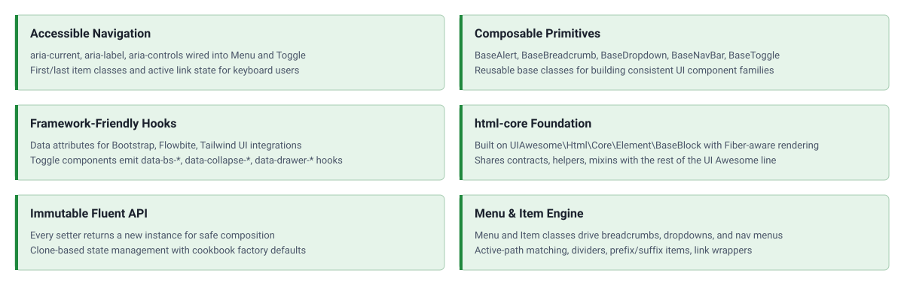

<!-- markdownlint-disable MD041 -->
<p align="center">
    <picture>
        
    </picture>
    <h1 align="center">Html Core Component</h1>
    <br>
</p>
<!-- markdownlint-enable MD041 -->

<p align="center">
    <a href="https://github.com/ui-awesome/html-core-component/actions/workflows/build.yml" target="_blank">
        
    </a>
    <a href="https://dashboard.stryker-mutator.io/reports/github.com/ui-awesome/html-core-component/main" target="_blank">
        
    </a>
    <a href="https://github.com/ui-awesome/html-core-component/actions/workflows/static.yml" target="_blank">
        
    </a>
    <a href="https://github.com/ui-awesome/html-core-component/actions/workflows/security.yml" target="_blank">
        
    </a>
</p>

<p align="center">
    <strong>Composable, immutable PHP primitives for building UI components: alerts, breadcrumbs, dropdowns, navbars, toggles, and menu items.</strong><br>
    <em>Accessible by default, fluent API, framework-friendly data hooks, and rendering powered by html-core.</em>
</p>

## Features

<picture>
    <source media="(max-width: 767px)" srcset="./docs/svgs/features-mobile.svg">
    
</picture>

### Installation

```bash
composer require ui-awesome/html-core-component:^0.3
```

### Quick start

This package ships both abstract base classes (for subclassing) and ready-to-use concrete classes (`Alert`, `Breadcrumb`, `Dropdown`, `NavBar`, `Toggle`, `Item`, `Menu`). The concrete classes can be used directly via `::tag()` without any subclassing.

The exposed abstractions are:

- `BaseAlert` / `Alert` dismissible alerts with prefix/suffix containers and an optional toggle.
- `BaseBreadcrumb` / `Breadcrumb` accessible breadcrumb navigation with active-path detection.
- `BaseDropdown` / `Dropdown` dropdown menus with toggles, dividers, and active-link wiring.
- `BaseNavBar` / `NavBar` navigation bars with brand, menu, and collapsible toggle.
- `BaseToggle` / `Toggle` button or link toggles with full data-attribute coverage (Bootstrap, Flowbite, Tailwind UI).

#### Custom breadcrumb

```php
use UIAwesome\Html\Core\Component\{BaseBreadcrumb, Item};

final class Breadcrumb extends BaseBreadcrumb {}

echo Breadcrumb::tag()
    ->items(
        Item::tag()->label('Home')->link('/'),
        Item::tag()->label('Library')->link('/library'),
        Item::tag()->label('Data')->active(true),
    )
    ->currentPath('/library')
    ->render();
```

#### Custom dropdown

```php
use UIAwesome\Html\Core\Component\{BaseDropdown, Item};

final class Dropdown extends BaseDropdown {}

echo Dropdown::tag()
    ->items(
        Item::tag()->label('Profile')->link('/profile'),
        Item::tag()->label('Settings')->link('/settings'),
        Item::tag()->divider('<hr>'),
        Item::tag()->label('Sign out')->link('/logout'),
    )
    ->render();
```

#### Custom navbar with toggle

```php
use UIAwesome\Html\Core\Component\{BaseNavBar, BaseToggle, Item};

final class NavBar extends BaseNavBar {}
final class Toggle extends BaseToggle {}

echo NavBar::tag()
    ->brandText('My App')
    ->brandLink('/')
    ->menu(
        Item::tag()->label('Home')->link('/'),
        Item::tag()->label('About')->link('/about'),
    )
    ->render();
```

#### Menu with wrapped labels

Each item label can be wrapped in its own element (for styling or truncation) via `labelTag`/`labelClass`. Without `labelTag`, the label renders as plain text.

```php
use UIAwesome\Html\Core\Component\{Item, Menu};
use UIAwesome\Html\Interop\Inline;

echo Menu::tag()
    ->type('nav')
    ->linkClass('nav-link')
    ->linkActiveClass('is-active')
    ->items(
        Item::tag()
            ->label('Request')
            ->link('/request')
            ->active()
            ->labelTag(Inline::SPAN)
            ->labelClass('nav-link-label'),
        Item::tag()
            ->label('Logs')
            ->link('/logs')
            ->labelTag(Inline::SPAN)
            ->labelClass('nav-link-label'),
    )
    ->render();
```

### Application-scoped styling

Framework styling is supplied by a `ThemeInterface` implementation resolved through `Config` and applied with `BaseTag::config()`. The theme reads the `ComponentContext` to pick the recipe, so variants (`danger`, `info`, `warning`, ...) travel with the context instead of being hard-coded on the component.

```php
use UIAwesome\Html\Core\Component\Alert;
use UIAwesome\Html\Core\Config\{Call, ComponentContext, Config, Cookbook, Recipe};
use UIAwesome\Html\Core\Theme\ThemeInterface;

final class AppTheme implements ThemeInterface
{
    public function getName(): string
    {
        return 'app';
    }

    public function getRecipes(ComponentContext $context): iterable
    {
        if ($context->component !== 'alert' || $context->variant === null) {
            return;
        }

        yield new Recipe(
            'app.alert',
            new Cookbook(new Call('class', "alert alert-{$context->variant}")),
        );
    }
}

$config = new Config(new AppTheme());

echo Alert::tag()
    ->config($config, new ComponentContext('alert', variant: 'danger'))
    ->content('Watch out!')
    ->render();
```

Configuration composes by precedence, not by call order: `config()` applies the resolved recipes immediately, so every fluent call made afterwards stays a local override.

For per-instance defaults that do not belong to a theme, pass them to the factory:

```php
use UIAwesome\Html\Core\Component\Alert;

echo Alert::tag(['class' => 'alert alert-danger'])->content('Watch out!')->render();
```

> [!NOTE]
> The `Bootstrap5` and `Flowbite` cookbooks were removed in `0.3.0`. Flowbite is discontinued, and the Bootstrap 5
> presets are being republished as standalone theme packages. See the [Upgrade Guide](UPGRADE.md) for the migration.

## Documentation

For detailed configuration options and advanced usage.

- 🧪 [Testing Guide](docs/testing.md)
- ⬆️ [Upgrade Guide](UPGRADE.md)

## Package information

[](https://www.php.net/releases/8.3/en.php)
[](https://packagist.org/packages/ui-awesome/html-core-component)
[](https://packagist.org/packages/ui-awesome/html-core-component)

## Quality code

[](https://codecov.io/github/ui-awesome/html-core-component)
[](https://github.com/ui-awesome/html-core-component/actions/workflows/static.yml)
[](https://github.com/ui-awesome/html-core-component/actions/workflows/linter.yml)
[](https://github.styleci.io/repos/776381948?branch=main)

## Our social networks

[](https://x.com/Terabytesoftw)

## License

[](LICENSE)
